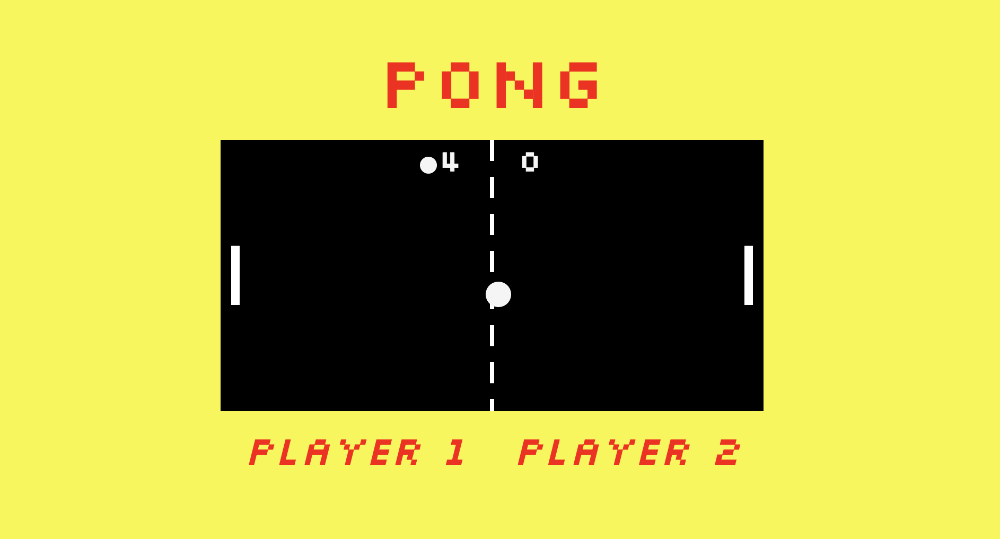

# Pong Game

A basic Pong game with two pong-balls. This game was built using vanilla Javascript, with the graphics being rendered in SVG.

## Setup

**Install dependencies:**

`> npm i`

**Run locally with Webpack Dev Server:**

`> npm start`

**Build for production:**

`> npm run build`

## Keys

**Player 1:**

- a: up
- z: down

**Player 2:**

- ▲ : up
- ▼: down

**Description:**

A basic Pong game with two Pong-balls. This game is a two player game. The goal in this game is to block the two balls from entering your goal by using your paddle. First player to obtain 5 points is the winner.

**Technology Used:**

HTML5
CSS3
JavaScript
SVG

**Built With:**

Visual Studio - Code Editor
Webpack - task runner
Git - Github
Chrome

### Screenshot

